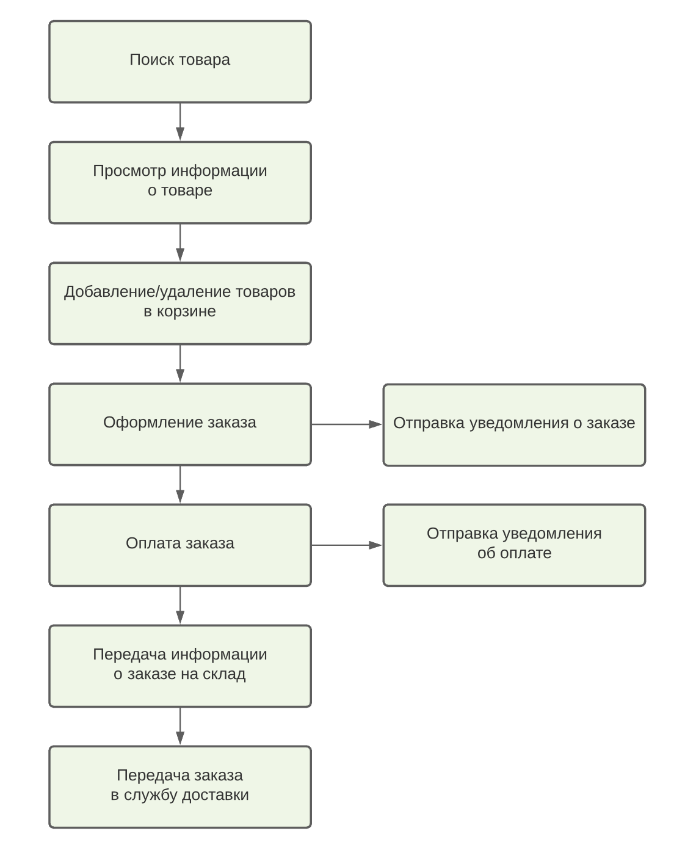

## Декомпозиция микросервисов для создания интернет-магазина

### Пользовательские сценарии

Есть клиент  
И есть интернет-магазин  
И клиент вводит в строке поиска "Велосипед"  
Тогда появляется список товаров, подходящих под запрос клиента

Когда клиент нажимает карточку на товар в списке результатов поиска  
Тогда клиент переходит на карточку с описанием товара

Когда клиент нажимает на кнопку "Добавить в корзину"  
Тогда товар добавляется в корзину

Когда клиент переходит в корзину  
Тогда он видит список всех добавленных им в корзину товаров

Когда клиент нажимает на кнопку "Удалить из корзины"  
Тогда товар удаляется из корзины

Когда клиент нажимает в корзине на кнопку +1 или -1 для товара  
Тогда количество единиц данного товара меняется соответственно нажатой кнопке

Когда клиент нажимает на кнопку "Оформить заказ"   
Тогда клиент переходит на страницу оформления заказа, которая предлагает заполнить адрес и дату доставки или же использовать данные по умолчанию

Когда клиент при оформлении заказа переходит к оплате  
Тогда возникает форма оплаты

Когда клиент производит оплату заказа  
Тогда появляется окно "Заказ оплачен"  
И клиенту приходит уведомление с информацией о заказе и успешной оплате  
И заказ резервируется на складе  
И создаётся заявка для службы доставки

### Системные действия:
- клиент может искать товар, используя те или иные фильтры
- клиент может получить информацию о товаре
- клиент может положить товар в корзину
- клиент может удалить товар из корзины
- клиент может изменить количество добавленных в корзину товаров
- клиент может оформить заказ
- клиент может указать адрес, время и дату доставки
- клиент может выбрать способ оплаты
- клиент может оплатить заказ
- приложение отправляет клиенту уведомление с информацией о сделанном заказе
- приложение отправляет клиенту уведомление об успешной/неуспешной оплате
- приложение резервирует товар на складе после оформления заказа
- приложение передаёт заказ в службу доставки

### Модель на основе ООП

Основные сущности:
- Клиент
- Товар
- Корзина
- Заказ
- Уведомление
- Склад
- Оплата
- Служба доставки

## Диаграммы классов (пользователи и роли) 

## Диаграммы классов (продукты и категории)

## Диаграммы классов (корзина, товар, заказ)

## Диаграммы классов (аккаунт и платеж)

## Диаграммы классов (склад и товары)

Сервисы:
- ClientService
- ProductService
- CartService
- OrderService
- NotificationService
- WarehouseService

А также:
- PaymentService
- DeliveryService

### Функциональная модель

Сервисы:
- ProductSearchService (поиск товара и просмотр информации о нём)
- OrderService (добавление/удаление товаров в корзине и оформление заказа)
- WarehouseService (передача информации о заказе на склад) 
- NotificationService (отправка уведомлений)
- PaymentService (оплата заказа)
- DeliveryService (передача заказа в службу доставки)

### Итоговая модель

Доработка модели:
- Поскольку работа с корзиной во многом связано с оформлением заказа, 
сервисы CartService и OrderService, получившиеся в модели на основе ООП, сильно связные.
Есть смысл объединить их в один - OrderService (он же получился и в функциональной модели).

Сервисы:
- Client
- ProductCatalog
- Order
- Payment
- Warehouse
- Delivery
- Notification

### Схема взаимодействия сервисов

### Системные действия в виде API

**auth-service**
- создание клиента: POST /api/v1/register {RegRequest dto}  
- получение клиента по id: GET /api/v1/user/{id}

**product_service**
- просмотр списка товаров: GET /api/v1/product
- получение информации о товаре по id: GET /api/v1/product/{id}

**order-service**
- получение корзины по id: GET /api/v1/order/cart {shopUser}
- добавление продукта в корзину: POST /api/v1/order/cart/add {AddItemRequestDto dto}

- получение статуса заказа по id: GET /api/v1/order/status/{id}
- создание заказа: POST /api/v1/order/cart/submit { shopUser }
- изменение заказа: PUT /api/v1/order/status/{id} { shopUser, orderId, status }
- отмена заказа: DELETE /api/v1/order/{id}

**payment-service**
- пополнение баланса: POST /api/v1/account/fiil-up {shopUser, fillUpRequestDto}

**inventory-service**
- передача данных о заказе на склад: POST /api/v1/reserve {oder}

**delivery-service**
- передача заказа в сервис доставки: POST /api/v1/delivery {order}

**notification-service**
- отправка письма: POST /api/internal/notification {emailRequestDto}

### Описание сервисов

----------------------

**Название**: auth-service  
**Описание**: Сервис для хранения информации о клиенте, регистрации клиента, аутентификации и авторизации клиента,
генерации, валидации токена. 
При регистрации киента отправляет сообщение в Kafka для создания аккаунта клиента 
**Запросы**:
- получение клиента по id: GET /api/v1/user/{id}
- аутентификация клиента : POST auth/login {authRequestDto :{login, password}}

**Команды**:
- создание клиента: POST /api/v1/register {regRequestDto}

**События**:
- событие о необходимости создать аккаунт пользователя: EVENT {CREATE_ACCOUNT, accountModel}

**Зависимости**:
- 

**Вопросы**: -

----------------------

**Название**: product-service  
**Описание**: Сервис для поиска товаров и хранения информации о них. 

**Запросы**:
- просмотр списка товаров: GET /api/v1/product
- получение информации о товаре по id: GET /api/v1/product/{id}

**Команды**:
- добавить продукт: POST /api/v1/product {productDto}
- изменить продукт: PUT /api/v1/product {productDto}
- удалить продукт:DELETE /api/v1/product/{id}

**Вопросы**:
- Хранить товары в монге?

----------------------
**Название**: order-service  
**Описание**: Сервис для работы с корзиной и оформлением заказа. 
После оформления заказа отправляет в Kafka сообщение о необходимости произвести списание денег с аккаунта и резервирование товара на складе
**Запросы**:
- получение корзины по id: GET /api/v1/order/cart {shopUser}
- получение статуса заказа по id: GET /api/v1/order/status/{id}

**Команды**:
- добавление продукта в корзину: POST /api/v1/order/cart/add {AddItemRequestDto dto}
- создание заказа: POST /api/v1/order/cart/submit { shopUser }
- изменение заказа: PUT /api/v1/order/status/{id} { shopUser, orderId, status }
- отмена заказа: DELETE /api/v1/order/{id}

**События**:
- событие о необходимости зарезервивовать товар на складе: EVENT {ORDER_RESERVE_PRODUCTS, reserveModel}
- событие о необходимости списать деньги с аккаунта: EVENT {ORDER_PAYMENT_PROCESS, paymentModel} 
- событие о необходимости отправить уведомление клиенту о том, что статус заказа изменился: EVENT {NOTIFICATION_SEND, notificationModel}

**Зависимости**:
- получение цены товара от product-service 
- получение актуального количетсва товара на складе notification-service
- событие от payment-service об оплате заказа: EVENT {PAYMENT_CONFIRMATION, paymentConfirmModel} 
- событие от inventiry-service об успешном резервировании товара: EVENT {ORDER_RESERVE_CONFIRMATON, reserveConfirmationModel}

**Вопросы**:
- После создания заказа корзина очищается или же создаётся новая? Логичнее очищать
----------------------
**Название**: payment-service  
**Описание**: Сервис оплаты. Отправляет событие об статусе оплаты для заказа.  
**Запросы**:  
**Команды**:
- пополнение баланса: POST /api/v1/account/fiil-up {shopUser, fillUpRequestDto}

**События**:
- отправляет событие об успешной или нейспешной оплате заказа: EVENT {ORDER_CONFIRMATION_TOPIC, model}

**Зависимости**:
- событие от order-service о необходимости списать деньги со счета при оформлении заказа: EVENT {ORDER_PAYMENT_PROCESS, paymentModel}
- получение от auth-service события о необходимости создать аккаунт клиента при его регистрации: EVENT {CREATE_ACCOUNT, accountModel}

**Вопросы**: 
----------------------
**Название**: inventory-service  
**Описание**: Сервис склада. Хранит информацию о товарах и их количестве.

**Запросы**: -  
**Команды**:
- передача данных о заказе на склад: POST /api/v1/reserve {oder}

**События**:
- событие о успешном резерве товаров на складе : EVENT {ORDER_RESERVE_CONFIRMATON, reserveConfirmationModel}

**Зависимости**: -  
**Вопросы**: -
----------------------

**Название**: delivery-service  
**Описание**: Сервис доставки заказов клиентам.  
**Запросы**: -  
**Команды**:
- передача заказа в сервис доставки: POST /api/v1/delivery {order}

**События**: -  
**Зависимости**: -  
**Вопросы**: -  
----------------------

**Название**:  notification-service  
**Описание**: Сервис отправки уведомлений клиентам.  
**Запросы**: -  
**Команды**: -  
**События**: -  
**Зависимости**:
- событие от order-service для отправки уведомления клиенту о заказе: EVENT {NOTIFICATION_SEND, notificationModel}
- событие для payment-service отправки уведомления клиенту об оплате: EVENT {NOTIFICATION_SEND, notificationModel}

**Вопросы**: -
