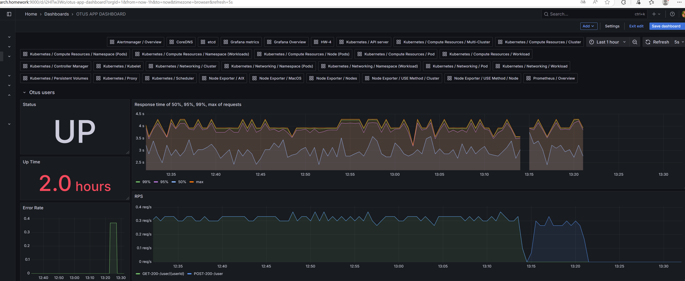
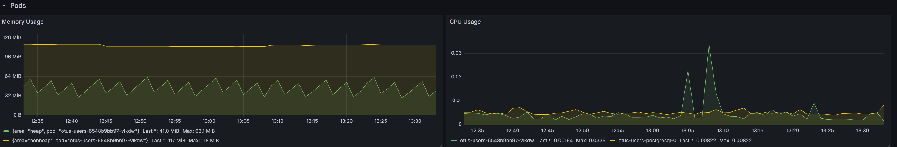

# Домашнее задание
## Prometheus. Grafana

# Цель:
В этом ДЗ вы научитесь инструментировать сервис.

## Описание/Пошаговая инструкция выполнения домашнего задания:

Инструментировать сервис из прошлого задания метриками в формате Prometheus с 
помощью библиотеки для вашего фреймворка и ЯП.


- Сделать дашборд в Графане, в котором были бы метрики с разбивкой по API методам:

1. Latency (response time) с квантилями по 0.5, 0.95, 0.99, max
2. RPS
3. Error Rate - количество 500ых ответов

- Добавить в дашборд графики с метрикам в целом по сервису, взятые с nginx-ingress-controller:

1. Latency (response time) с квантилями по 0.5, 0.95, 0.99, max
2. RPS
3. Error Rate - количество 500ых ответов

Настроить алертинг в графане на Error Rate и Latency.


- На выходе должно быть:

1. скриншоты дашборды с графиками в момент стресс-тестирования сервиса. 
    Например, после 5-10 минут нагрузки.
2. json-дашборды.


### Задание со звездочкой

- Используя существующие системные метрики из кубернетеса, добавить на дашборд графики с метриками:

1. Потребление подами приложения памяти
2. Потребление подами приолжения CPU

- Инструментировать базу данных с помощью экспортера для prometheus для этой БД.
- Добавить в общий дашборд графики с метриками работы БД.

## Порядок выполнения работы 

Добавить репозиторий в helm

````bash
helm repo add prometheus-community https://prometheus-community.github.io/helm-charts
````

Обновить репозиторий

````bash
helm repo update
````

Установить пакет kube-prometheus-stack


---------- Вариант 2 - устанавливаем весь стек - прометей + оператор + графана
````bash

helm install stack prometheus-community/kube-prometheus-stack -f C:\Users\alexa\IdeaProjects\12-2024-microservices-novikova\2024-12-Microservices-Novikova\hw05\yaml\prometheus.yaml

````

Проверить что все запустилось

````bash
kubectl get pods -l "release=prometheus"
````

Добавить сервис типа NodePort для прямого доступа к Prometheus и Grafana:

```shell script
kubectl apply -f prometheus/monitoring-nodeport.yaml

```

```shell script
minikube service -n monitoring prometheus-grafana-nodeport
```

Другой вариант:

Прокидываем прометус
```shell script
kubectl port-forward service/prometheus-operated  9090
```


Прокидываем графану
```shell script
kubectl port-forward service/stack-grafana  9000:80
```
admin / prom-operator

Доступ к Prometheus:
arch.homework:9090

Открыть web-интерфейс Grafana:
arch.homework:9000

default login - admin password - prom-operator


Установка ingress-nginx с поддержкой метрик
```shell script
helm upgrade --install ingress-nginx ingress-nginx `
  --repo https://kubernetes.github.io/ingress-nginx `
--namespace ingress-nginx --create-namespace `
  --set controller.metrics.enabled=true `
--set controller.metrics.serviceMonitor.enabled=true `
--set controller.metrics.serviceMonitor.additionalLabels.release="kube-prometheus-stack"
```

Выбрать dashboard "OTUS APP DASHBOARD"

### Benchmarks

Load Testing For API With Apache Benchmark

В Windows перейти в директорию расположения ab.exe (C:\Apache24\bin) 
вызвать из командной строки :

```shell script
.\ab.exe -n 500 -c 50 http://arch.homework/user/1
```

````bash
C:/Apache24/bin/ab -n 100000 -c 100 -H'Host: arch.homework' http://arch.homework/users
````

Для симуляции нагрузки на приложение (метод POST)

````bash
./create-users.sh
````

Для симуляции нагрузки на приложение (метод GET)

````bash
./get-users.sh
````

Для симуляции 500 ответов от приложения

````bash
./error.sh
````

### Скриншоты в момент стресс-тестирования сервиса




### Потребление подами памяти и Потребление подами CPU



[json-дашборд](dashboards/otus_dashboard.json)

