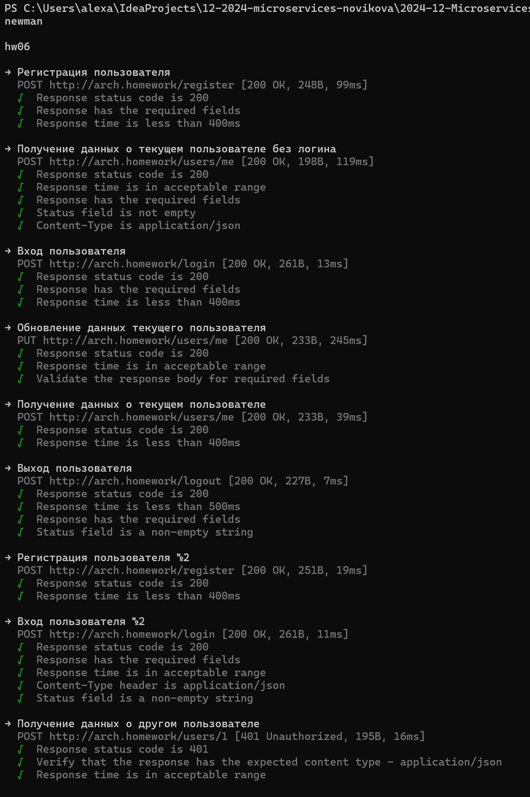
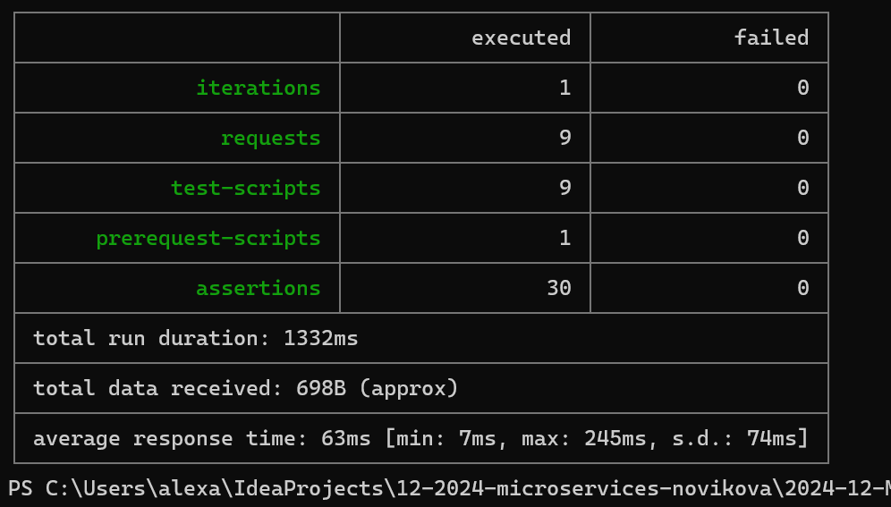

## Microservice Architecture
### Тема: API Gateway и Backends For Frontends
#### Задание №5:

Добавить в приложение аутентификацию и регистрацию пользователей.

Реализовать сценарий "Изменение и просмотр данных в профиле клиента":
- Пользователь регистрируется.
- Заходит под собой и по определенному урлу получает данные о своем профиле.
- Может поменять данные в профиле.
- Данные профиля для чтения и редактирования не должны быть доступны другим клиентам (аутентифицированным или нет).

На выходе должны быть
1) описание архитектурного решения и схема взаимодействия сервисов (в виде картинки)
2) команда установки приложения (из helm-а или из манифестов). Обязательно указать в каком namespace нужно устанавливать.
   2*) команда установки api-gateway, если он отличен от nginx-ingress.
3) тесты постмана, которые прогоняют сценарий:
- регистрация пользователя 1
- проверка, что изменение и получение профиля пользователя недоступно без логина
- вход пользователя 1
- изменение профиля пользователя 1
- проверка, что профиль поменялся
- выход* (если есть)
- регистрация пользователя 2
- вход пользователя 2
- проверка, что пользователь2 не имеет доступа на чтение и редактирование профиля пользователя1.

В тестах обязательно
- наличие {{baseUrl}} для урла
- использование домена arch.homework в качестве initial значения {{baseUrl}}
- использование сгенерированных случайно данных в сценарии
- отображение данных запроса и данных ответа при запуске из командной строки с помощью newman.

------------------------------------------------------------------

docker images:
- alexadubinina87/hw-06-auth-app:v11
- alexadubinina87/hw-06-service:v12

#### Запуск и проверка работоспособности:

В начале убедиться, что nginx ingress запущен
```shell script
minikube addons list
minikube addons enable ingress
minikube addons list
```
Устанавливаем  чарт приложений для аутентификации и для данных пользователей:
```shell script
helm install hw06 helmChart
```

Запускаем тесты с помощью newman и проверяем, что все корректно запустилось:
```shell script
newman run hw06.postman_collection.json -e hw06.postman_environment.json
```
# Результаты:



