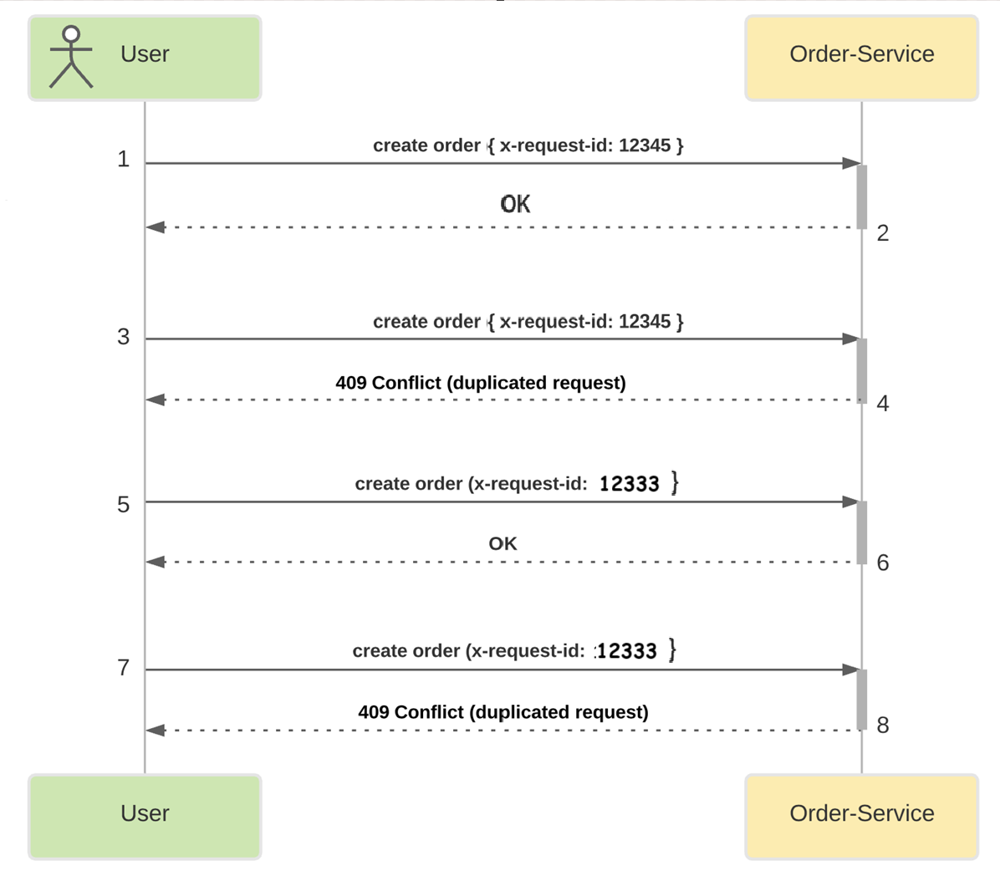
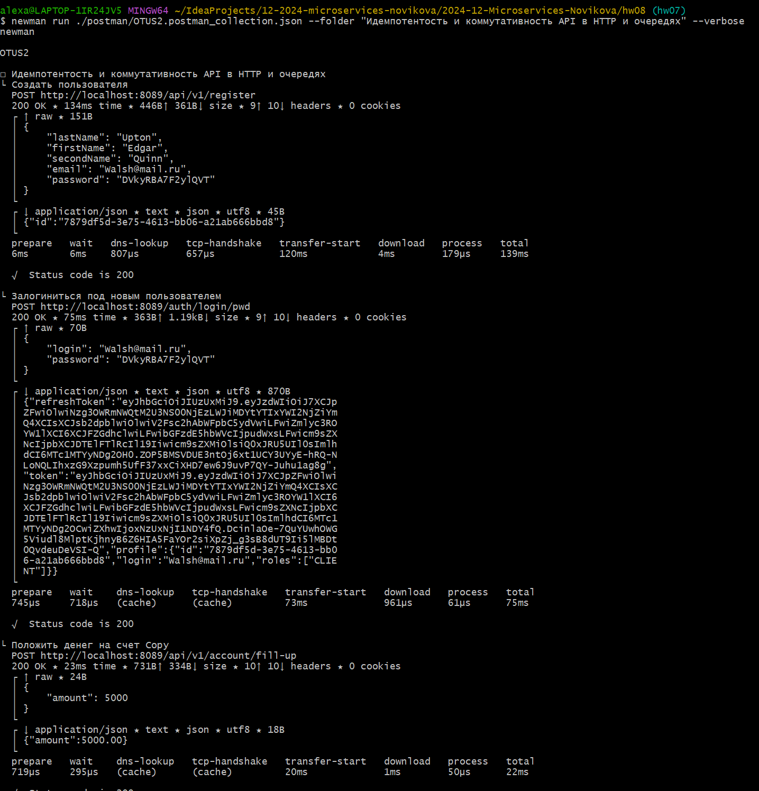
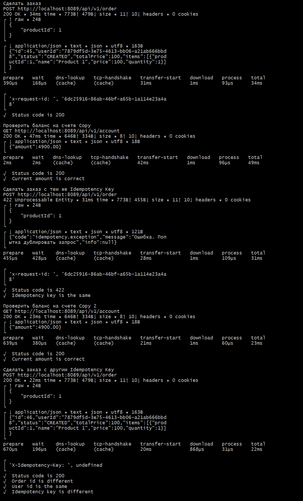
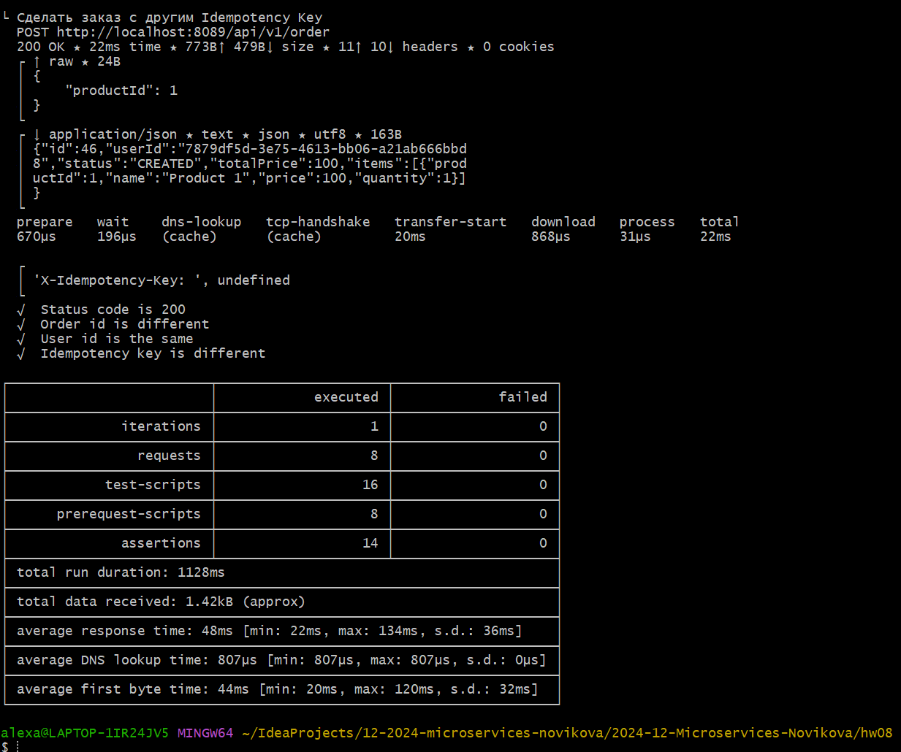

## Собрать проект
mvn package

## Собрать и запушить docker образы приложений
```
docker image build --platform linux/amd64 -t alexadubinina87/auth-service:13 .
docker image build --platform linux/amd64 -t alexadubinina87/auth-gateway:12 .
docker image build --platform linux/amd64 -t alexadubinina87/notification-service:12 .
docker image build --platform linux/amd64 -t alexadubinina87/order-service:12 .
docker image build --platform linux/amd64 -t alexadubinina87/payment-service:12 .

docker push alexadubinina87/auth-service:13
docker push alexadubinina87/auth-gateway:12
docker push alexadubinina87/notification-service:12
docker push alexadubinina87/order-service:12
docker push alexadubinina87/payment-service:12

```

## Создать namespace
```
kubectl create namespace otus
```
## Установить ingress
```
helm install nginx ingress-nginx/ingress-nginx --namespace otus -f nginx-ingress.yaml
kubectl apply -f ./charts/ingress/ingress.yaml
helm upgrade --install nginx ingress-nginx/ingress-nginx --namespace otus -f ./charts/ingress/values.yaml
```

## Установить postgres
```
helm install otus-postgres ./charts/components/postgres --namespace otus -f ./charts/components/postgres/values.yaml
```

## Установить Kafka
```
helm upgrade -i my-kafka oci://registry-1.docker.io/bitnamicharts/kafka -n otus --set service.port=9092 --set auth.enabled=false --set auth.clientProtocol=plaintext --set kafka.autoCreateTopicsEnable=true --set listeners.client.protocol=plaintext
```

## Установить приложения
```
helm upgrade -i auth-gateway ./shop-charts/apps/auth-gateway --namespace otus --atomic -f ./charts/apps/auth-gateway/values.yaml
helm upgrade -i auth-service ./shop-charts/apps/auth-service --namespace otus --atomic -f ./charts/apps/auth-service/values.yaml
helm upgrade -i notification-service ./shop-charts/apps/notification-service --namespace otus --atomic -f ./charts/apps/notification-service/values.yaml
helm upgrade -i order-service ./shop-charts/apps/order-service --namespace otus --atomic -f ./charts/apps/order-service/values.yaml
helm upgrade -i payment-service ./shop-charts/apps/payment-service --namespace otus --atomic -f ./charts/apps/payment-service/values.yaml
```

## Запустить postman коллекцию
```
newman run ./postman/OTUS2.postman_collection.json --folder "Идемпотентость и коммутативность API в HTTP и очередях" --verbose
```

Идемпотентность реализована с помощью ключа идемпотентности x-request-id в рамках сервиса order-service.
Генерация ключа происходит в Order-service.



Результат тестирования



